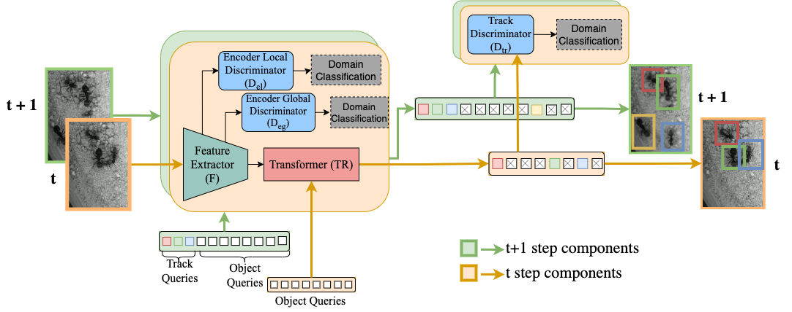

# DA-Tracker: Unsupervised domain adaptive multi object tracker

This repository provides the official implementation of the [Tracking Different Ant Species: An Unsupervised Domain Adaptation
Framework and a Dataset for Multi-object Tracking](https://arxiv.org/pdf/2301.10559.pdf) paper.


<div align="center">
    
</div>

## Abstract

Tracking individuals is a vital part of many experiments conducted to understand collective behaviour. Ants are the paradigmatic model system for such experiments but their lack of individually distinguishing visual features and their high colony densities make it extremely difficult to perform reliable tracking automatically. Additionally, the wide diversity of their species’ appearances makes a generalized approach even harder. In this paper, we propose a data-driven multi-object tracker that, for the first time, employs domain adaptation to achieve the required generalisation. This approach is built upon a joint-detection-and-tracking framework that is extended by a set of domain discriminator modules integrating an adversarial training strategy in addition to the tracking loss. In addition to this novel domain-adaptive tracking framework, we present a new dataset and a benchmark for the ant tracking problem. The dataset contains 57 video sequences with full trajectory annotation, including 30k frames captured from two different ant species moving on different background patterns. It comprises 33 and 24 sequences for source and target domains, respectively. We compare our proposed framework against other domainadaptive and non-domain-adaptive multi-object tracking baselines using this dataset and show that incorporating domain adaptation at multiple levels of the tracking pipeline yields significant improvements
<div align="center">
    
    <figcaption> A schematic of our proposed network architecture. The multi-object tracking module predicts detected boxes and associate them between two frames in a unified network. To ensure our proposed framework can adapt to the target data distribution, the intermediate layer feature representations are enforced to follow a common data distribution. The conversion happens at two levels: Image encoded features, track level</figcaption>

</div>

## Installation

1. Clone and enter this repository:
    ```
    git clone git@github.com:chamathabeysinghe/da-tracker.git
    cd da-tracker
    ```

2. Install packages for Python 3.7:

    1. `pip3 install -r requirements.txt`
    2. Install PyTorch 1.5 and torchvision 0.6 from [here](https://pytorch.org/get-started/previous-versions/#v150).
    3. Install pycocotools: `pip install -U 'git+https://github.com/timmeinhardt/cocoapi.git#subdirectory=PythonAPI'`

3. Download and unpack datasets in the `data` directory:

## Train

```shell
python src/train.py with tracking mot17 \
    output_dir=OUTPUT_DIR \
    mot_path=data/SOURCE_DATASET \
    mot_path_target=data/TARGET_DATASET \
    train_split=train \
    val_split=val \
    epochs=100 \
    vis_port=8097 \
    seq_data_folder=TARGET_DATASET \
    name=exp_name \
    disc_loss_coef_local=50 \
    disc_loss_coef_global=50 \
    disc_loss_decoder_coef_global=50 
```

### Evaluate and visualize results

``` shell
ffmpeg -i data/snakeboard/snakeboard.mp4 -vf fps=30 data/snakeboard/%06d.png

python src/track.py with \
    dataset_name=DEMO \
    data_root_dir=data/snakeboard \
    output_dir=data/snakeboard \
    write_images=pretty
```

## Publication
If you use this software in your research, please cite our publication:

```
@article{abeysinghe2023tracking,
  title={Tracking Different Ant Species: An Unsupervised Domain Adaptation Framework and a Dataset for Multi-object Tracking},
  author={Abeysinghe, Chamath and Reid, Chris and Rezatofighi, Hamid and Meyer, Bernd},
  journal={arXiv preprint arXiv:2301.10559},
  year={2023}
}
```